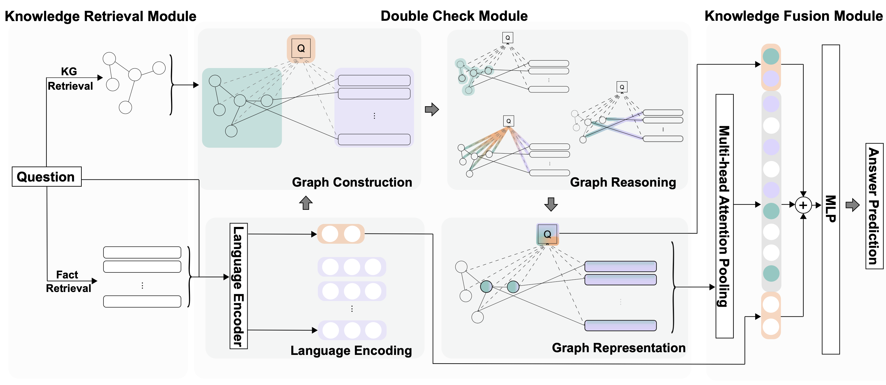

# Decker: Double Check with Heterogeneous Knowledge for Commonsense Fact Verification

**DECKER**, consists of three major modules: (i) Knowledge Retrieval Module which retrieves heterogeneous knowledge based on the input question; (ii) Double Check Module which merges information from structured and unstructured knowledge and makes a double check between them; (iii) Knowledge Fusion Module which combines heterogeneous knowledge together to obtain a final representation.




## Requirements

Install all required python dependencies:

```
pip install -r requirements.txt
```

## Datasets

Download the required knowledge bases:

```sh
sh download_rawdata_resource.sh
```

Download the datasets from the following repository and put them under `data/creak` and `data/csqa2`:

```
https://github.com/yasumasaonoe/creak/tree/main/data/creak
https://github.com/allenai/csqa2/tree/master/dataset
```

## Implementations

### Data preprocessing

Data preprocessing consists of three stages: (i) Ground concepts; (ii) Retrieve facts; (iii) Process and load graph information.

```
cd data_preprocess
sh data_preprocess.sh
```

### Training

```sh
sh confact_train.sh
```

Or for example, run the following:

```sh
DATA="creak"
MODEL="microsoft/deberta-v3-large"
LR="9e-6"
BS="32"
ML="128"
PD_BS="16"
SEED="666666"

OUTPUT="${MODEL}_${DATA}_lr${LR}_bs${PD_BS}_ml${ML}_seed${SEED}"

python run_confact.py \
  --task ${DATA} \
  --train_path data/${DATA}/graph/train_graph_numnode20.jsonl \
  --dev_path data/${DATA}/graph/dev_graph_numnode20.jsonl \
  --test_path data/${DATA}/graph/dev_graph_numnode20.jsonl \
  --num_train_epochs 5 \
  --save_strategy epoch \
  --evaluation_strategy epoch \
  --load_best_model_at_end true \
  --model_name_or_path ${MODEL} \
  --max_seq_length ${ML} \
  --learning_rate ${LR} \
  --per_device_train_batch_size ${PD_BS} \
  --per_device_eval_batch_size 32 \
  --output_dir saved_outputs_my/${OUTPUT} \
  --do_train \
  --do_eval \
  --do_predict \
  --seed ${SEED} \
  --contra_path data/${DATA}/graph/contrast_graph_numnode20.jsonl
```

